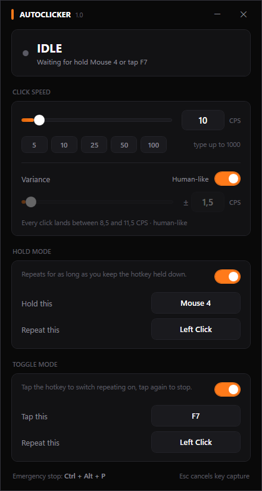

# AutoClicker

A Windows autoclicker with two independent hotkey pairs, an adjustable click rate, and a
black / white / orange interface.



## What it does

* **Hold mode** — while you keep a hotkey held down, a chosen key or mouse button is
  repeated. Releasing the hotkey stops it.
* **Toggle mode** — tap a hotkey once to start repeating, tap it again to stop.
* Both modes have their own hotkey **and** their own repeated key, and each can be
  switched off on its own.
* Anything can be bound to anything: mouse buttons (including Mouse 4 / Mouse 5) and
  keyboard keys work as both hotkeys and as the repeated input.
* **Click rate** is set with the slider (1–100) or by typing an exact value (1–1000)
  into the box. Presets are one click away.
* **Variance** spreads the rate out so the timing never repeats. At 10 CPS with a variance
  of 3, every single click is scheduled somewhere in 7–13 CPS. The card shows the resulting
  range live.
* **Human-like** derives the variance from the rate automatically (±15%) and takes the
  manual controls read-only. Switch it off to dial the spread in yourself.
* **Emergency stop:** `Ctrl + Alt + P` halts everything immediately.
* Settings are remembered in `%AppData%\AutoClicker\settings.json`.

Defaults: hold `Mouse 4` → repeat `Left Click`, tap `F7` → repeat `Left Click`, 10 CPS,
human-like variance on.

### About the variance

Every click draws its own rate, uniformly, from `rate ± variance`. Uniform is deliberate:
across a fixed range it is the maximum-entropy distribution, so it is the least predictable
option available within the bounds you set. The draws come from the OS cryptographic RNG
rather than a seeded PRNG, whose sequence could in principle be reconstructed from a long
enough recording of click timings. The length of each press is jittered too, so neither the
gap between clicks nor the duration of one settles into a pattern.

Human-like mode uses ±15% of the rate. A uniform draw that wide has a standard deviation of
roughly 8.7% of the rate, which lands in the range measured for people tapping repeatedly.

Measured over an 8 second run at 10 CPS ± 3: clicks landed between 7.02 and 12.97 CPS, with
70 distinct gap lengths across 77 clicks. In human-like mode at 10 CPS: 8.53–11.39 CPS with
a gap standard deviation of 9.1%.

One consequence worth knowing: averaging *rates* is not the same as averaging *delays*, so
a symmetric window around 10 CPS produces a true average slightly below 10 (9.73/s measured
at ±3, 9.96/s at human-like ±1.5). The range is exactly what you set; the mean drifts a
little low, and the wider the variance the larger that drift.

## Build and run

Requires the [.NET 8 SDK](https://dotnet.microsoft.com/download).

```bash
dotnet run --project src/AutoClicker/AutoClicker.csproj
```

### Building an .exe

Small exe (0.2 MB) — needs the [.NET 8 Desktop Runtime](https://dotnet.microsoft.com/download/dotnet/8.0)
on the machine that runs it:

```bash
dotnet publish src/AutoClicker/AutoClicker.csproj -c Release -r win-x64 --self-contained false -p:PublishSingleFile=true -o publish
```

Standalone exe (68 MB) — one file, no runtime needed, copy it anywhere:

```bash
dotnet publish src/AutoClicker/AutoClicker.csproj -c Release -r win-x64 --self-contained true -p:PublishSingleFile=true -p:EnableCompressionInSingleFile=true -p:IncludeNativeLibrariesForSelfExtract=true -o publish-standalone
```

The native-library flag matters: without it WPF's native DLLs (`wpfgfx_cor3.dll` and
friends) are dropped next to the exe instead of being bundled into it.

## How it works

* Global `WH_KEYBOARD_LL` / `WH_MOUSE_LL` hooks detect hotkeys anywhere in Windows, so the
  window does not need focus. They run on a dedicated thread with its own message pump, so
  UI work can never stall input delivery (Windows silently drops hooks that answer too
  slowly).
* Clicks are generated with `SendInput`. Every generated event is stamped with a marker in
  `dwExtraInfo` that the hook recognises and ignores — without it the clicker would
  re-trigger itself.
* Keyboard output is sent as scan codes so DirectInput-based games accept it.
* The repeat loop runs on its own high-priority thread and paces itself with
  `Stopwatch` ticks: a coarse sleep followed by a short spin, under `timeBeginPeriod(1)`.
  Measured on a 2 second run, 50 CPS lands at 50.4/s with a median gap of exactly 20.0 ms.

## Notes

* Windows will not let a normal process send input to a window running as administrator.
  If the target app is elevated, run AutoClicker as administrator too.
* Anti-cheat systems in online games generally detect and ban synthetic input. Use this on
  software where automation is allowed.

## Layout

```
src/AutoClicker/
  MainWindow.xaml(.cs)   UI and hotkey wiring
  Themes/Dark.xaml       colour palette and control styles
  Core/ClickEngine.cs    the timed repeat loop
  Core/AppSettings.cs    JSON persistence
  Input/InputKey.cs      a key or mouse button, plus its display name
  Interop/               hooks, SendInput, P/Invoke declarations
```
